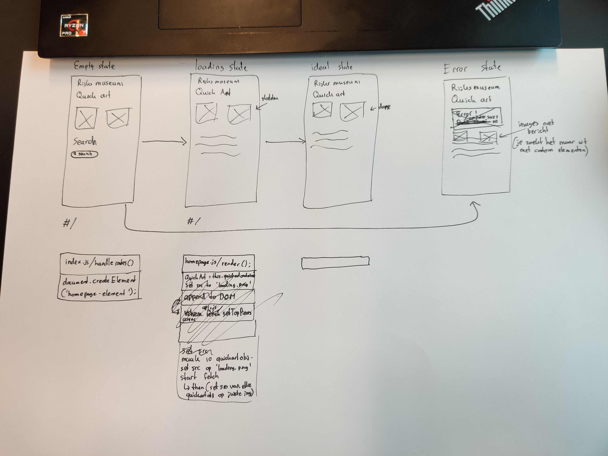

# Web App From Scratch - Rijksmuseum App

This is an app for school that uses the Rijksmuseum API to display art.
It's a web app (single page application).

## Week 2 - Begin

Ik heb gekozen voor de Rijksmuseum opdracht omdat dit een leuke opdracht leek.
Er moet een beetje design in en je kan leuke dingen doen met Javascript hiervoor.

Om te beginnen heb ik een design getekend.

Hier is de beginpagina, de details pagina en de kunstenaar pagina beschreven.
De kunstenaarpagina is later vervangen door een zoekpagina, maar het design is ongeveer hetzelfde.

Ik ben begonnen met het maken van de pagina in HTML en CSS en heb later JS toegepast om er meer een app van te maken.
Het is een beetje achterhaald en onhandig gedaan, maar de JS code voegt na bepaalde acties een `
` toe aan de onderkant van de pagina, die met een `z-index` naar de bovenkant van de pagina wordt gesleept.
Er vindt een fading animatie plaats om deze transitie een beetje netjes te laten gaan.

Toen ik later snel meer leerde over CSS kwam ik er een beetje achter dat ik dit beter had kunnen doen met iets meer CSS en de Javascript een beetje simpeler te laten worden.
Zo hoeft de zogehete `pagefiller` `
` niet door Javascript toegevoegd te worden aan de pagina, maar kan je ook gebruik maken van CSS focus states om dit te regelen.

Dit is iets dat ik in week 3 wil gaan aanpassen, als we gaan refactoren.

## Week 3 Maandag - Refactoring met Routie en Web Components

In week 3 ben ik op maandag begonnen met het herschrijven van de code op bepaalde plekken.
Ik heb weinig veranderd aan de HTML, want dat was allemaal wel best zo.

In plaats daarvan heb ik de Javascript aangepast.
Ik ben overgestapt van de matige CSS SPA workaround met mijn `pagefiller`, naar een megachad methode met [routie](https://projects.jga.me/routie/#toc0) en Web Components.

Ik heb de pagina's herschreven naar Web Components en zo heb ik de code iets minder lelijk gemaakt.
Het is veel beter overzichtelijk nu en je kan makkelijker wijzigingen doorvoeren naar een pagina.
Ik heb wel gekozen om geen gebruik te maken van de Shadow DOM.
Naar mijn weten geeft het je de mogelijkheid om je Web Component's DOM te scheiden van de rest van de DOM.
Zo kan je makkelijk styling toevoegen aan het component zonder dat je aan andere componenten zit.
Opzich wel chill, maar dat zou betekenen dat ik mijn CSS moest gaan aanraken, en daar had ik geen zin in vandaag.
Ik ging me vandaag al het diepe in gooien door mijn code om te gooien om te werken met Routie en Web Components, als ik daarbij CSS moest gaan doen dan werd het te lastig, dus dat heb ik nog niet gedaan.

Over algemeen was het omzetten naar Web Components vrij pijnloos.
Er waren weinig grote hindernissen waar ik tegenaan ben gelopen, naast het probleem met de verdwijnende data, wat in de sectie hierna wordt beschreven.

Web Components zijn wel geinig.

### Probleem 1 - Quick Art Object

Het QuickArtObject object is een web componentn en neemt als data waarde de response uit de API in.
Wanneer de data variable word geassigned dan wordt de setter functie aangeroepen.
Deze roept op zijn beurt de render functie aan.

Nou was het probleem dat pas later dit object werd toegevoegd aan de DOM.
Wanneer dit gebeurde verloor het de data en kreeg ik errors in de console en in de code.

Dit werd opgelost toen ik in de `homepage.js` code de `quickArtContainer` vulde via de `appendChild` methode.
Eerst deed ik dit via een string literal.
Waarom dit gebeurt weet ik nog niet, maar ik ben erg blij dat het is opgelost.

### Week 3 Dinsdag - Diagram

Op dinsdag ben ik begonnen met het maken van de diagrammen die we moesten maken.
Ik heb een wireflow, activity diagram en swimlane diagram gemaakt.

Ik ben daarna begonnen met het toevoegen van de verschillende states van de applicatie.
Vooral belangrijk was het maken van de loading state.
Momenteel is er weinig indicatie dat de interface aan het laden is op de achtergrond.

Ik heb de loading state toegevoegd.
Wanneer de pagina laadt worden de art elementen geladen op de pagina.
Hiervan worden de image sources gezet op een `loading.png` image.
De Web Components zijn reactive, dus nadat de image geladen is hoef je alleen maar de image source en de title te veranderen naar de juiste image en dan veranderd die gelijk mee.

Ook heb ik de error state toegevoegd.
Dit kan je bereiken als de fetch naar de API faalt.
Wanneer dit gebeurt krijg je het volgende te zien:

Dit is natuurlijk een beetje een grap, maar dit is wel intended behavior.

### Probleem 2 - Die deur

Op maandag en dinsdag van week 3 was de deur op de gang kapot.
Elke keer dat iemand hem opende maakte hij een hard piepend geluid.
Omdat de deur zo langzaam sluit duurde dat geluid ook echt heel lang.
Dit was ontzettend hinderlijk.

### Week 4 Maandag - Refactoring

Ik heb in week 4 de code een beetje opgeschoond.
Er waren een aantal functies die niks deden of op een andere manier redundant waren.
Ook was er voldoende code dat gewoon niet precies deed wat het moest doen of niet werkte.
Dat heb ik opgeruimd en nu is het beter.
